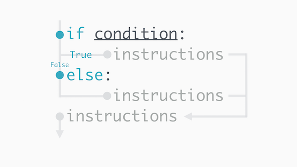

An `else` can be written immediately after an `if` statement's block. There cannot be a condition for the `else` statement.

Notice the `else` statement is indented at the same level as the `if` statement.

