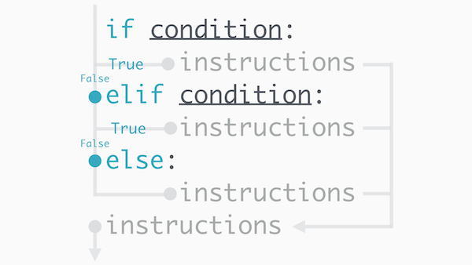

A common situation where the `elif` is seen is in an `if`-`elif`-`else` statement. You can think of `if`-`elif`-`else` as a way to choose between a set of actions that are run independently of each other. An `if`-`else` chooses to perform either of two distinct actions, while an `if`-`elif`-`else` can choose between more than two.

